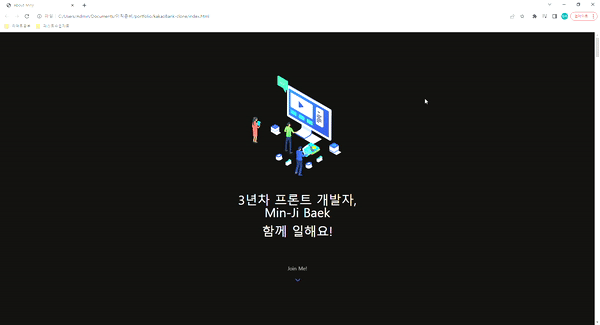
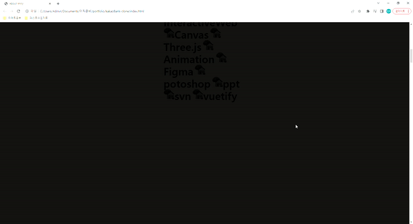
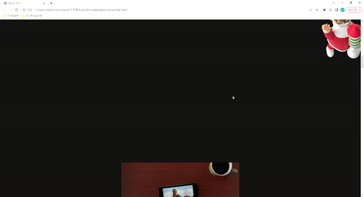
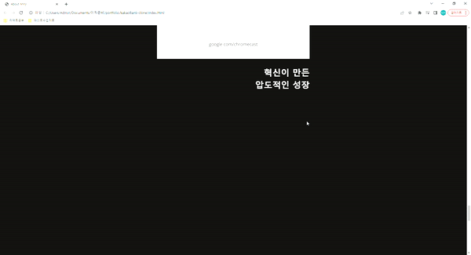
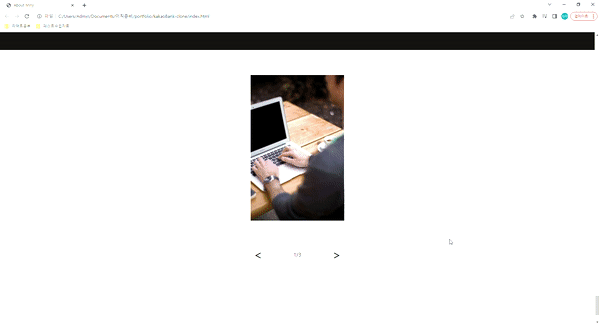

# kakaoBank-page-clone
  

  카카오뱅크 홈페이지를 클론 해보는 프로젝트이다. html, javascript, css 만을 사용할 예정이며 자주 사용되는 slider library도 직접 만들어보며 연습해보는 시간을 갖는다.
  
  이직을 준비 중인 내 상황에 맞게 포토폴리오 느낌으로 만들 수 있는 부분은 포폴 느낌으로 클론 page로 만들었다. 

  https://minji-baek.github.io/kakaoBank-page-clone/

  

   

## 1. title
  

  - title 하단에 계속 움직이는 animation 화살표를 배치

  

  - 스크롤 값과 색이 변해야되는 text 영역의 높이의 비율을 계산하여 스크롤 하면 순서대로 text의 color가 바뀌고 icon이 변경

  - 임의의 스크롤 영역을 벗어나면 변경 text는 모두 없어짐

 

## 2. Santa 

  - change text 영역을 벗어나면 santa가 해당 스크롤 영역 안에서 스크롤 값 만큼 transform을 진행
  
  

 

## 3. video

  - video를 화면 중앙에 고정
  
  - video에 스크롤 가능 영역을 할당, 영역을 스크롤 하되 video는 고정
  
  - 스크롤해야 영상이 재생됨
  
  - 재생 초반 text가 하단에서 투명도를 높이며 상단으로 이동하며 영상 하단에 고정.
  
  - 재생 후 고정이 풀린다. 
  
  

 

## 4. fix-image & slider

  - text image가 스크롤에 맞춰 올라 오다가 중앙에 도착 후 fix.
  
  - 다시 하단으로 스크롤은 된다.
  
  

 

  - slider 가 최대를 넘으면 다시 처음으로 혹은 최소를 넘으면 마지막으로 넘어간다. 
  
  

 

## 이론

### css 

  - scroll-snap
    -- 스크롤 할때 스냅에 대한 css 장치 축, 무빙의 정의를 정할 수 있다.
